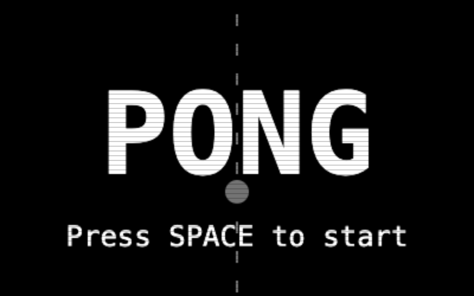

# Pong Arcade

A browser-based classic Pong game — no frameworks, no build tools, just one HTML file.

## Live Demo

[stonedhawk.github.io/pong-arcade](https://stonedhawk.github.io/pong-arcade)

## How to Play

| Action | Keys |
|--------|------|
| Move paddle up | W or Arrow Up |
| Move paddle down | S or Arrow Down |
| Start / Restart | Space |

- First to **7 points** wins
- Ball speeds up slightly with each paddle hit
- Hit the ball with the edge of your paddle for sharper angles

## How to Run

No installation needed. Just open `index.html` in any modern browser (Chrome, Firefox, Safari).

## Tech Stack

- Vanilla JavaScript
- HTML5 Canvas API
- `requestAnimationFrame` game loop
- Zero dependencies

## License

MIT
